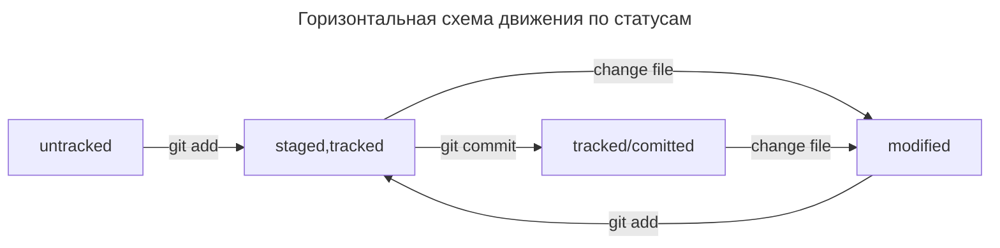
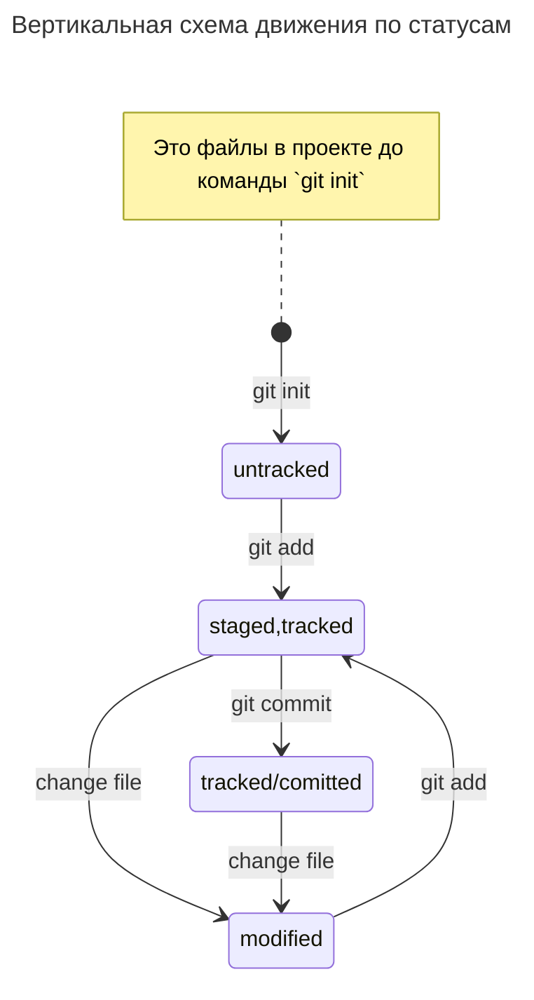

# Шпаргалка markdown

## Выделение текста

Вы можете выделять текст в markdown с помощью символов `_` или `*`. Например:

Пример _курсива_ и **жирного** текста.

## Заголовки

Заголовки можно создавать с помощью символа `#`. Чем больше `#`, тем меньше заголовок. Например:

# Заголовок первого уровня
## Заголовок второго уровня
### Заголовок третьего уровня

## Выделение кода

Чтобы выделить текст как код, поместите его в тройные кавычки "```". 

```
mkdir my_project
cd my_project
git init
ls -al
```

Это лишь некоторые функции markdown.
Больше информации на [GitHub Docs](https://docs.github.com/en/get-started/writing-on-github/getting-started-with-writing-and-formatting-on-github/basic-writing-and-formatting-syntax).

## Список основных команд по работе с git в консоли:
`git version` **тут понятно**<br>
`git init` **инициализация проекта в текущей папке**<br>
`git status` **текущее состояние проекта**<br>
`git add .` **добавление всех файлов в папке в проект**<br>
`git commit -m "Comment"` **подтверждаем изменения в репозиторий**<br>
> `git add && git commit -m "comment"`
>**можно объединить в одну команду `git commit -a -m "comment"`**

`git config --global user.name "$USERNAME"` **Конфигурим подключение в конфиге git**<br>
`git config --global user.email "$USERMAIL"` **Конфигурим подключение в конфиге git**<br>
`git config --global init.defaultbranch "main"` **Меняем название дефолтной ветки** (Или можно было инициализировать проект при помощи команды `git init -b main`)<br>
`git config --list` **Проверяем переменные**<br>
`git remote add origin git@github.com:$USERNAME/$PROJECTNAME.git` **подключаем текущий репозиторий к удалённому. На Гитхаб должен быть прокинут ключ SSH**<br>
`git remote -v` **проверка подключения**<br>
`git push -u origin main` **публикуем в ветку main**<br>
`git push` **публикуем в удалённый репозиторий(default branch)**<br>
## Информационный блок:
`git log` **инфа о коммитах, указан хеш(SHA-1), автор, дата и комментарий**<br>
`git log --oneline` **инфа о коммитах построчно. Выводятся только несколько необходимых для отличия символов хеша**<br>
>Самый свежий коммит **`HEAD`**  (лежит в .git/HEAD) указывает на файл с хешем коммита, например .git/refs/heads/main
>Указатель `HEAD` можно использовать в командной строке.<br>

`git status` выводит статусы untracked/tracked, staged и modified<br>






### Для изменения последнего коммита(HEAD) следует использовать флаг --amend
`git commit --amend -m "Новый комментарий"` **Меняет комментарий**<br>
`git add new.file && git commit --amend --no-edit` **Добавляет в коммит новый файл**<br>
`git commit --amend` **Открывает редактор для ручной правки**<br>

### Для перевода файлов из статуса staged обратно в untracked(или в modified):
`git add primer.txt` **Добавление ненужного файла**<br>
`git restore --staged primer.txt` **Убираем файл**<br>

### Откат коммита по хешу:
`git log --oneline` **Ищем нужную точку**<br>
`git reset --hard b576d89` **Хэш, на который нужно откатиться**<br>

### Откат изменений в отслеживаемом файле:
`git restore primer.txt`<br>

### Просмотр и сравнение изменений:
`git diff` **Сравнить последний коммит с текущим modified**<br>
`git add . && git diff --staged` **Просмотр изменений в staged area**<br>
`git log --oneline && git diff 91080da HEAD` **Сравнение первого и последнего коммитов**<br>

### Игнорирование файлов:
`git status --ignored`
```
cat .gitignore
# ignore all
**<br>
# But not pdf|tex
!**.tex<br>
!**.pdf<br>
```

# Работа с ветками
`git branch` **Смотрим ветки в проекте локально**<br>
`git checkout -b feature/markets` **Создать новую ветку и переключиться в неё**<br>
